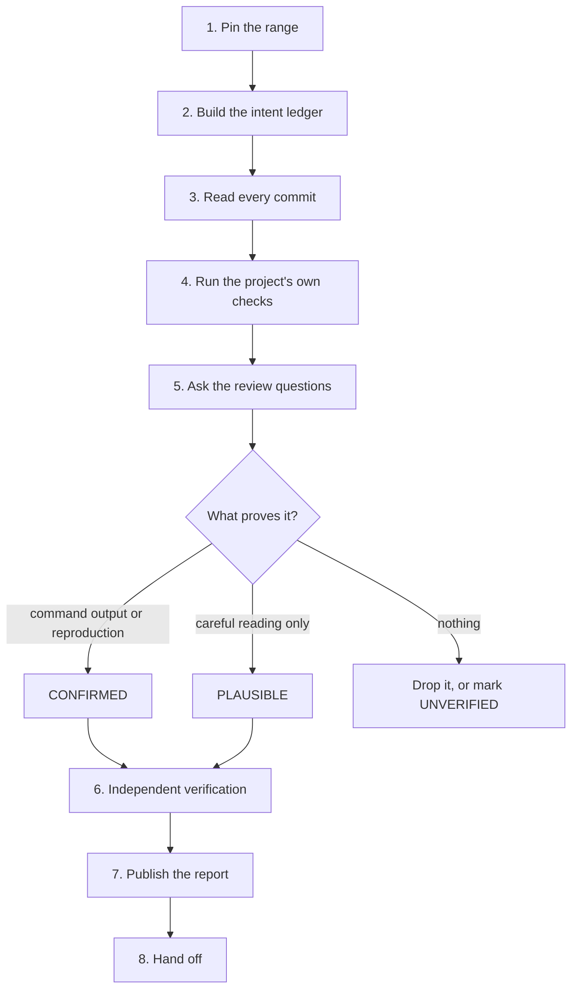

# Review Past Commits

Answer two questions about work that already landed, with evidence: **is this what we meant to build, and what did it break?**

## Required skills

Load each skill when its trigger appears. Do not repeat its work here.

| Trigger | Skill |
|---------|-------|
| A subagent dispatch, a model tier, or an is-it-done decision | `commander` |
| A finding needs a root cause, not a symptom | `hard-problem-solving` |
| Ancestry must be repaired, not only read: merging, reconciling, or integrating branches | `merge-branches-to-master` |
| A finding must become a tracked work item | `create-github-tickets` |
| A later agent must find this run | `llm-wiki` |
| The report needs a diagram, an HTML page, or a video | `explainer` |

Use the host's own code-review command for the line-level pass when the host has one. This skill owns the range, the evidence, and the report.

## Core principles

**Review the range, not the label.** Pin a base commit and a head commit first. A branch name, a graph line, or a stale local ref states history that is no longer true. Only ancestry commands state it correctly.

**Measure against recorded intent.** A review with no statement of what the work was meant to do grades style, not correctness.

**Evidence or it is not a finding.** Each one carries a location and a concrete failure path. A check that did not run is reported as not run.

## Workflow

### 1. Pin the range

Resolve the base and the head to full commit ids. For a branch or a pull request, the base is the merge base, not the tip of the default branch. Use the pinned ids in every later command, in the report title, and in every dispatch.

Done when: the range is two commit ids, and the commit count and file count are known.

### 2. Build the intent ledger

Collect what the work claimed to do: commit messages, pull request bodies, tickets, specs, acceptance criteria, decision records. Read the project's own contributor and agent instructions. The review measures the work against this ledger.

Done when: every commit maps to a claim, or is marked as having no recorded intent.

### 3. Read every commit

Keep the per-commit story: what changed, and why. Follow the real flow through the artifact, because a diff hides everything it did not touch.

**Find every dependent of each changed public thing** — a function, an endpoint, a schema field, a configuration key, a file format, a published name. For each, record updated, or confirmed unaffected. This single step finds the most defects: a fix applied at one call site leaves its siblings broken, and the checks still pass.

Done when: each commit has a one-line summary, and every changed public thing has its dependents listed.

### 4. Run the project's own checks

Run what the project already has, whatever its kind: build, types, lint, format, tests, schema validation, simulation, render, deploy dry-run. Quote the exact exit codes. Prefer a detached worktree so the user's working copy stays untouched.

Where the project has continuous integration, read its result for the exact head commit as well. A green run on a different commit proves nothing about this range.

Done when: each check has a command and an exit code, or a one-line reason why it could not run.

### 5. Ask the review questions

Work [the questions](#the-review-questions) at the end of this file. Grade and format each finding with [reference.md](reference.md).

Done when: every question has a recorded answer — a finding, or "none" with what was looked at. The answers go in the report's own table, so the reviewer in step 6 can test them. An unanswered question is an unreviewed range.

### 6. Verify independently

The agent that wrote a finding does not accept it. Dispatch a fresh-context, read-only reviewer to check the artifacts, not the summary. Grade every finding:

- **CONFIRMED** — a command, a test, or a reproduction shows it.
- **PLAUSIBLE** — careful reading shows it, and nothing executed it.
- **UNVERIFIED** — state the specific claim that could not be checked, and why.

Drop the findings that do not survive. Keep the grade visible in the report.

Done when: each surviving finding carries a grade and its evidence line.

### 7. Publish the report

Write the report with the template in [reference.md](reference.md). Then put it where the project already keeps such files, and commit it.

A report that exists only in a temporary directory, a local scratch folder, or terminal output is invisible to every other agent and to the user's team. Link committed paths.

Follow the project's branch policy to publish: push a review branch or open a pull request where the default branch is protected or shared. The read-only rule in step 6 binds the verification agent, not the agent that owns the review.

Done when: the report is committed, reachable by the project's normal route, and every link in it points at a committed path.

### 8. Hand off

State the verdict, the highest severity, and the next action. Record the run so a later agent can resume it.

Done when: the verdict names the highest severity and the next action, and anything promised earlier is either delivered or reported as not done.

## The review questions

Ask all of them against the range. Each one is domain-neutral; bind it to whatever this project is made of. [examples.md](examples.md) holds worked instances of each.

1. **Intent.** Does each change do what its recorded intent said, no less and no more? Take the ledger one claim at a time: met, not met, or deferred with its tracked item. Name the unrecorded extras. A claim nobody can check is itself a finding.
2. **Authority.** Who or what can now reach something it could not reach before? Check the guard that decides, not the caller that happens to pass today.
3. **Dependents.** What else relies on the thing that changed, and does it still hold? Across code, data, configuration, documentation, and downstream consumers.
4. **Weakened proof.** Which check got easier to pass? Removed, skipped, gated, loosened, silenced, or simply never run. Compare the executed count against the claimed count.
5. **One-way doors.** What cannot be undone after this ships? Deletions, migrations, published artifacts, external calls. Ask how each is reversed, and report when there is no answer.
6. **Order and repetition.** What breaks when this runs twice, runs out of the expected order, runs concurrently with itself, or runs half-way and stops?
7. **Boundaries.** What crosses a line it should not? Private data into a public surface, internal detail into a published interface, a secret into a log. Search the private names across the outward-facing layers, and report the result either way.
8. **Assumptions about input.** What does the change take for granted about the values it receives, and what happens at the edge of that assumption?
9. **Weight added.** What was built that nothing needs yet? Name it; recommend removal only when removal is smaller than the thing.
10. **Worth copying.** Which patterns should other agents reuse? Give each a location, up to four. Omit the section when the range holds none; a quota filled with praise teaches less than silence.

Severity follows reach and reversibility, not the question number. A gap that only a test can trigger today still rates high when the next change hands it to real users.

## History claims

Treat these claims as unproven until a command answers them:

| Claim | Command that settles it |
|-------|------------------------|
| "This branch never merged" | `git branch --no-merged`, then `git merge-base --is-ancestor` |
| "This work is missing" | `git cherry`, then `git range-diff` |
| "The merge changed the tree" | `git diff --exit-code` |

[reference.md](reference.md) carries the argument forms.

Rebased work keeps its behaviour and loses its commit ids. Prove equivalence before reporting a gap, and prove absence before reporting a loss. Hand repair work to `merge-branches-to-master`; this skill only reads ancestry.

## Stop and ask

Stop and ask the user before deleting a branch, rewriting history, force-pushing, or closing a tracked item. Report the ancestry evidence and the recommendation instead of acting.

Preserve original commit ids and merge records unless the user asks for a rebase or a squash.

## Resources

- [reference.md](reference.md) — normative: git forensics commands, severity and grade scales, report template.
- [examples.md](examples.md) — illustrations: a worked instance of each question, worked findings, a worked history check, and a verification dispatch prompt.
