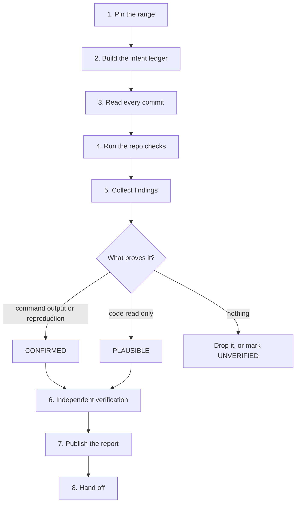

# Review Past Commits

Review a pinned range of history, prove each finding, and leave the report where other agents can read it.

## Required skills

Load each skill when its trigger appears. Do not repeat its work here.

| Trigger | Skill |
|---------|-------|
| A subagent dispatch, a model tier, or an is-it-done decision | `commander` |
| A finding needs a root cause, not a symptom | `hard-problem-solving` |
| Ancestry must be repaired, not only read: merging, reconciling, or integrating branches | `merge-branches-to-master` |
| A finding must become a tracked work item | `create-github-tickets` |
| A later agent must find this run | `llm-wiki` |
| The report needs a diagram, an HTML page, or a video | `explainer` |

Use the host's own code-review command for the line-level pass when the host has one. This skill owns the range, the evidence, and the report.

## Core principle

**Review the range, not the label.** Pin a base commit and a head commit first. A branch name, a graph line, or a stale local ref states history that is no longer true. Only ancestry commands state it correctly.

## Workflow

### 1. Pin the range

Resolve the base and the head to full SHAs. For a branch or a pull request, the base is the merge base, not the tip of the default branch. Record both SHAs. Use them in every later command, in the report title, and in every dispatch.

Done when: the range is two SHAs, and the commit count and file count are known.

### 2. Build the intent ledger

Collect what each commit claimed to do: commit messages, pull request bodies, tickets, specs, acceptance criteria, architecture decision records. Read the repo's own agent instructions and coding standards. The review measures the code against this ledger.

Done when: every commit in the range maps to a claim, or is marked as having no recorded intent.

### 3. Read every commit

Keep the per-commit story: what changed, and why. Follow the real call flow across files, because a diff hides the callers it does not touch.

**Grep every caller of each changed public symbol.** For each hit, record updated, or confirmed unaffected. This single step finds the most defects: a guard, a contract, or a type fixed in one caller leaves its siblings broken, and the build still passes.

Done when: each commit has a one-line summary, and every changed public symbol has its callers listed.

### 4. Run the repo checks

Run the checks the repo already has: build, types, lint, format, tests, schema or migration checks. Quote the exact exit codes. Prefer a detached worktree so the user's working tree stays untouched.

Read the continuous-integration result for the exact head SHA as well. A green run on a different SHA proves nothing about this range.

Done when: each check has a command and an exit code, or a one-line reason why it could not run.

### 5. Collect findings

Work [the checklist](#checklist-what-to-notice) at the end of this file. Grade and format each finding with [reference.md](reference.md).

### 6. Verify independently

The agent that wrote a finding does not accept it. Dispatch a fresh-context, read-only reviewer to check the artifacts, not the summary. Grade every finding:

- **CONFIRMED** — a command, a test, or a reproduction shows it.
- **PLAUSIBLE** — a careful code read shows it, and nothing executed it.
- **UNVERIFIED** — state the specific claim that could not be checked, and why.

Drop the findings that do not survive. Keep the grade visible in the report.

Done when: each surviving finding carries a grade and its evidence line.

### 7. Publish the report

Write the report with the template in [reference.md](reference.md). Then put it where the repo already keeps such files, for example `artifacts/` or `docs/reviews/`, and commit it.

A report that exists only in a temporary directory, a local scratch folder, or terminal output is invisible to every other agent and to the user's team. Link committed paths.

Follow the repo's branch policy to publish: push a review branch or open a pull request where the default branch is protected or shared. The read-only rule in step 6 binds the verification agent, not the agent that owns the review.

Done when: the report is committed, reachable by the repo's normal route, and every link in it points at a committed path.

### 8. Hand off

State the verdict, the highest severity, and the next action. Record the run so a later agent can resume it.

## Checklist: what to notice

### Access control and trust boundaries

- A write or delete function takes a raw record id and never checks the owner against the session subject.
- A guard exists on one route and is missing on a sibling route that reaches the same data.
- A page, job, or handler renders before the guard runs.
- A guard sits in the caller instead of the shared function every caller routes through.

Report the fix at the shared layer. A per-caller fix leaves the next caller broken. A gap that only tests and seed scripts can reach today is still HIGH, because the first route that calls the function activates it.

### The weakened oracle

- Tests skipped, gated on an environment variable, or deleted inside the range.
- Assertions loosened, timeouts raised, or lint rules silenced to turn red into green.
- An executed test count lower than the count the commit message or pull request claims.

State both numbers. A suite that quietly shrinks reports success it did not earn.

### Data lifecycle

- A restore that clears every soft-delete marker instead of the one deletion batch, so rows the user deleted on purpose come back.
- A cascade that reaches further than the record being deleted.
- A seed or fixture that overwrites rows a real user may own.
- A job described as idempotent that diverges on the second run.

### Concurrency

- Rows locked in an order that depends on input order.
- A unique constraint used as the only protection instead of a backstop.
- Sleeps or retries added around a race the change introduced.
- A two-phase write whose intermediate state is visible to readers.

### Schema and migration

- The migration and the schema disagree on a constraint, an index, an enum, or a foreign-key action.
- A migration sorts before a migration already applied upstream.
- An index dropped that a live query still needs, or added beside one that already covers it.

### Boundary leakage

- A private or internal field crossing into a client bundle, a log line, a serialized payload, or an error message.
- Credentials, hosts, or tokens inside an error string.

Grep the private field names across the client and logging layers, and report the result either way.

### Validation at the edge

- A range, a length, or a format accepted that later code assumes is already valid.
- A date, money, or identifier parsed by a check weaker than the type it produces.

### Spec drift

Check each acceptance criterion from the intent ledger one at a time. State met, not met, or deferred with its tracked item. A criterion nobody can check is itself a finding.

### Over-engineering

Name abstractions with one implementation, dead configuration, and unused exports. Recommend removal only when the removal is smaller than the abstraction.

### Done well

Name two to four patterns other agents should copy, each with a `file:line`. A review that lists only defects teaches nothing once they are fixed.

## History claims

Treat these claims as unproven until a command answers them:

| Claim | Command that settles it |
|-------|------------------------|
| "This branch never merged" | `git branch --no-merged`, then `git merge-base --is-ancestor` |
| "This work is missing" | `git cherry`, then `git range-diff` |
| "The merge changed the tree" | `git diff --exit-code` |

[reference.md](reference.md) carries the argument forms.

Rebased work keeps its behaviour and loses its commit ids. Prove equivalence before reporting a gap, and prove absence before reporting a loss. Hand repair work to `merge-branches-to-master`; this skill only reads ancestry.

## Stop and ask

Stop and ask the user before deleting a branch, rewriting history, force-pushing, or closing a tracked item. Report the ancestry evidence and the recommendation instead of acting.

Preserve original commit ids and merge records unless the user asks for a rebase or a squash.

## Resources

- [reference.md](reference.md) — git forensics commands, severity and grade scales, report template.
- [examples.md](examples.md) — worked findings, a worked history check, and a verification dispatch prompt.
