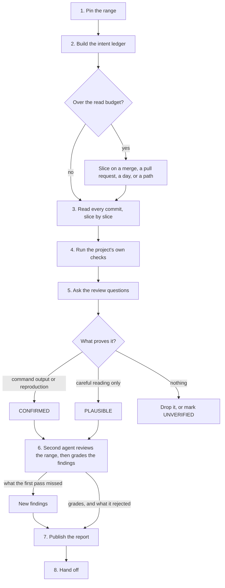

# Review Past Commits

Answer two questions about work that already landed, with evidence: **is this what we meant to build, and what did it break?**

## Required skills

Load each skill when its trigger appears. Do not repeat its work here.

| Trigger | Skill |
|---------|-------|
| A subagent dispatch, a model tier, or an is-it-done decision | `commander` |
| A finding needs a root cause, not a symptom | `hard-problem-solving` |
| Ancestry must be repaired, not only read: merging, reconciling, or integrating branches | `merge-branches-to-master` |
| A finding must become a tracked work item | `create-github-tickets` |
| A later agent must find this run | `llm-wiki` |
| The report needs a diagram, an HTML page, or a video | `explainer` |

A row is a routing hint, not a dependency. Hosts ship different skill sets, and an installed set can be older than this table. When no skill the host offers matches a row, do that row's work inline and record the substitution in the report's Method line. Never stop the review because a row did not resolve.

### The line-level pass

This skill owns the range, the evidence, and the report. A host code-review command owns the lines.

Hosts offer none, one, or several such commands. Choose at most one, by the first rule that settles it:

1. The one this project's own instructions name.
2. The one that takes a diff, a commit range, or a branch — this review is a range.
3. None. Running none is allowed.

That pass returns candidates, not findings. Bind each item it returns to one of [the review questions](#the-review-questions), then give it evidence here before it enters the findings table. An item you do not keep goes in that question's "what was looked at" cell, or in "Not checked".

Done when: the report names the command you chose and the ones you passed over, or states that the host offered none.

## Core principles

**Review the range, not the label.** Pin a base commit and a head commit first. A branch name, a graph line, or a stale local ref states history that is no longer true. Only ancestry commands state it correctly.

**Measure against recorded intent.** A review with no statement of what the work was meant to do grades style, not correctness.

**Evidence or it is not a finding.** Each one carries a location and a concrete failure path. A check that did not run is reported as not run.

## Workflow

### 1. Pin the range

Resolve the base and the head to full commit ids. For a branch or a pull request, the base is the merge base, not the tip of the default branch. Use the pinned ids in every later command, in the report title, and in every dispatch.

Done when: the range is two commit ids, and the commit count, the file count, and the changed-line count are known. Those counts decide the [read budget](#3-read-every-commit).

### 2. Build the intent ledger

Collect what the work claimed to do: commit messages, pull request bodies, tickets, specs, acceptance criteria, decision records. Read the project's own contributor and agent instructions. The review measures the work against this ledger.

Done when: every commit maps to a claim, or is marked as having no recorded intent.

### 3. Read every commit

**Read budget.** One pass reads at most **50 commits or 3,000 changed lines**, whichever comes first. Above either number, slice the range.

Those two numbers are the default, not the rule. The rule is the evidence this step owes. A pass is too large as soon as it can no longer produce a summary line for every commit and a dependent list for every changed public thing. Lower the numbers for a dense range, raise them for a range of one-line edits, and say in the report which you did.

**Slice on a boundary the history already has**, in this order: merge commit, then pull request, then day, then path. Do not slice by an arbitrary count. An arbitrary cut separates a change from its own fix, and then reports the fix as the defect. Pin each slice to two commit ids, the same way step 1 pins the range.

Read each slice as its own pass. Then answer the review questions once over the whole range: a defect that spans two slices is invisible inside either one.

Keep the per-commit story: what changed, and why. Follow the real flow through the artifact, because a diff hides everything it did not touch.

**Find every dependent of each changed public thing** — a function, an endpoint, a schema field, a configuration key, a file format, a published name. For each, record updated, or confirmed unaffected. This single step finds the most defects: a fix applied at one call site leaves its siblings broken, and the checks still pass.

Done when: each commit has a one-line summary, every changed public thing has its dependents listed, and the report states either that the range fit one pass, or the slice count, the boundary used, the pinned ids of each slice, and why that boundary.

### 4. Run the project's own checks

Run what the project already has, whatever its kind: build, types, lint, format, tests, schema validation, simulation, render, deploy dry-run. Quote the exact exit codes. Prefer a detached worktree so the user's working copy stays untouched.

Where the project has continuous integration, read its result for the exact head commit as well. A green run on a different commit proves nothing about this range.

**Name the risky paths this environment cannot run** — a live service, a data store, a device, a deployment target, a rendering or publishing step. A review that cannot run them produces a predictable inversion: the cheap findings earn CONFIRMED and the dangerous ones stay PLAUSIBLE. Expect the inversion and say it out loud. The grade states how sure you are; it never lowers a severity, and the verdict follows the highest severity, whatever its grade.

Done when: each check has a command and an exit code, or a one-line reason why it could not run, and every risky path that could not run is in the report's "Not checked" section with what would settle it.

### 5. Ask the review questions

Work [the questions](#the-review-questions) at the end of this file. Grade and format each finding with [reference.md](reference.md).

Each question is marked **diff** or **read**. Answer a **diff** question from the range diff: it is cheap, and "none" is its common answer. Spend the pass's reading time on the **read** questions. They need the artifact around the diff, and that is where the defects are.

Done when: every question has a recorded answer — a finding, or "none" with what was looked at. The answers go in the report's own table, so the reviewer in step 6 can test them. An unanswered question is an unreviewed range.

### 6. Verify independently

The agent that wrote a finding does not accept it. Dispatch a fresh-context, read-only reviewer. Give it the pinned ids, the checkout path, the slice list, and the claimed findings. Give it two jobs, in this order.

**a. Review the range, not the report.** The reviewer works the **read** questions over the artifacts itself, starting with every question the first pass answered "none", and reports each defect the first pass missed. This is the job that pays. A first pass misses what it did not think to look for, and only a second pass with its own eyes finds it. A reviewer that only grades the claimed findings inherits the first pass's blind spots.

**b. Grade each claimed finding**, against the artifacts and not the summary:

- **CONFIRMED** — a command, a test, or a reproduction shows it.
- **PLAUSIBLE** — careful reading shows it, and nothing executed it.
- **UNVERIFIED** — state the specific claim that could not be checked, and why.
- **REJECTED** — the artifact does not do what the finding claims.

Drop the rejected findings. Keep every surviving grade visible in the report. Carry each new finding from job (a) into the findings table, marked with its origin, and graded on the same scale.

Done when: the reviewer has reported its own findings, or "none" with the questions it re-ran; each surviving finding carries a grade, an origin, and its evidence line; and the report's Verification section names what the reviewer rejected and what it added.

### 7. Publish the report

Write the report with the template in [reference.md](reference.md). Then put it where the project already keeps such files, and commit it.

A report that exists only in a temporary directory, a local scratch folder, or terminal output is invisible to every other agent and to the user's team. Link committed paths.

Follow the project's branch policy to publish: push a review branch or open a pull request where the default branch is protected or shared. The read-only rule in step 6 binds the verification agent, not the agent that owns the review.

Done when: the report is committed, reachable by the project's normal route, and every link in it points at a committed path.

### 8. Hand off

State the verdict, the highest severity, and the next action. Record the run so a later agent can resume it.

Done when: the verdict names the highest severity and the next action, and anything promised earlier is either delivered or reported as not done.

## The review questions

Ask all of them against the range. Each one is domain-neutral; bind it to whatever this project is made of. [examples.md](examples.md) holds worked instances of each.

**diff** means the range diff answers it. **read** means the answer lives in the artifact the diff did not touch, so the question needs the surrounding read.

1. **Intent** (diff). Does each change do what its recorded intent said, no less and no more? Take the ledger one claim at a time: met, not met, or deferred with its tracked item. Name the unrecorded extras. A claim nobody can check is itself a finding.
2. **Authority** (read). Who or what can now reach something it could not reach before? Check the guard that decides, not the caller that happens to pass today.
3. **Dependents** (read). What else relies on the thing that changed, and does it still hold? Across code, data, configuration, documentation, and downstream consumers.
4. **Weakened proof** (diff). Which check got easier to pass? Removed, skipped, gated, loosened, silenced, or simply never run. Compare the executed count against the claimed count.
5. **One-way doors** (diff). What cannot be undone after this ships? Deletions, migrations, published artifacts, external calls. Ask how each is reversed, and report when there is no answer.
6. **Order and repetition** (read). What breaks when this runs twice, runs out of the expected order, runs concurrently with itself, or runs half-way and stops?
7. **Boundaries** (read). What crosses a line it should not? Private data into a public surface, internal detail into a published interface, a secret into a log. Search the private names across the outward-facing layers, and report the result either way.
8. **Assumptions about input** (read). What does the change take for granted about the values it receives, and what happens at the edge of that assumption?
9. **Weight added** (diff). What was built that nothing needs yet? Name it; recommend removal only when removal is smaller than the thing.
10. **Worth copying** (diff). Which patterns should other agents reuse? Give each a location, up to four. Omit the section when the range holds none; a quota filled with praise teaches less than silence.

A **diff** question still gets a row. "None, and what was looked at" is the cheapest honest answer there is, and it tells the next reviewer where not to spend its pass.

Severity follows reach and reversibility, not the question number. A gap that only a test can trigger today still rates high when the next change hands it to real users.

## History claims

Treat these claims as unproven until a command answers them:

| Claim | Command that settles it |
|-------|------------------------|
| "This branch never merged" | `git branch --no-merged`, then `git merge-base --is-ancestor` |
| "This work is missing" | `git cherry`, then `git range-diff` |
| "The merge changed the tree" | `git diff --exit-code` |

[reference.md](reference.md) carries the argument forms.

Rebased work keeps its behaviour and loses its commit ids. Prove equivalence before reporting a gap, and prove absence before reporting a loss. Hand repair work to `merge-branches-to-master`; this skill only reads ancestry.

## Stop and ask

Stop and ask the user before deleting a branch, rewriting history, force-pushing, or closing a tracked item. Report the ancestry evidence and the recommendation instead of acting.

Preserve original commit ids and merge records unless the user asks for a rebase or a squash.

## Resources

- [reference.md](reference.md) — normative: git forensics commands, severity and grade scales, report template.
- [examples.md](examples.md) — illustrations: a worked instance of each question, worked findings, a worked history check, and a verification dispatch prompt.
